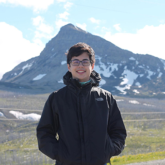

**I am a Ph.D. Student at [Northwestern University](https://www.northwestern.edu/) in the [Technology and Social Behavior program](https://tsb.northwestern.edu/).** In 2018, I graduated from the [University of Washington](https://www.washington.edu/) with a [B.S. in Computer Science](https://www.cs.washington.edu/).
After finishing my undergraduate degree, I worked as a software engineering intern at the [Allen Institute for Artificial Intelligence](https://allenai.org/), and as a software engineering intern at [Versive](https://www.versive.com/).

 

